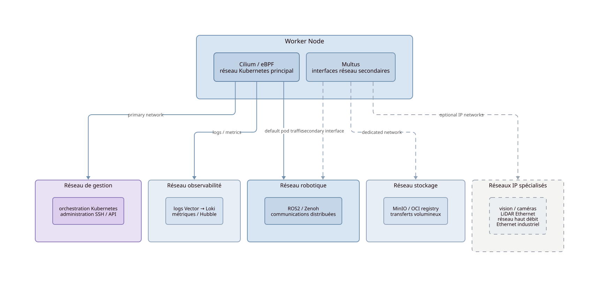

Réseau
=======

Le réseau n'est pas un simple transport transparent entre workloads. Il constitue une composante structurelle explicite de l'architecture robotique distribuée.

.. important::
   Kubernetes ne constitue pas l'unique couche de communication du système robotique. Le système porte simultanément des flux IP orchestrés, des middlewares distribués, des bus matériels et des interfaces firmware — chacun avec ses propres contraintes.

Introduction
-------------

KubeWI traite le réseau comme une ressource critique influençant directement :

- la latence et le jitter ;
- la résilience et les modes dégradés ;
- la visibilité du système distribué ;
- les capacités de communication entre nœuds, middlewares et composants embarqués.

L'architecture cherche à rendre les flux réseau explicites, observables et maîtrisables — pas à les abstraire.

Domaines réseau
----------------

La plateforme distingue plusieurs catégories de flux, chacune avec ses contraintes propres :

.. list-table::
   :header-rows: 1
   :widths: 25 75

   * - Domaine
     - Usage
   * - **réseau de gestion**
     - administration SSH, API Kubernetes, orchestration cluster
   * - **communications robotiques**
     - trafic middleware ROS2 et Zenoh entre pods et nœuds
   * - **réseau transferts**
     - OCI registry, MinIO, artefacts et données volumineuses
   * - **réseau observabilité**
     - logs Vector → Loki, métriques, flux Hubble
   * - **interfaces terrain**
     - bus matériels hors IP : CAN, I2C, SPI, UART, fieldbus

.. note::
   ROS2 et Zenoh sont des **middlewares**, pas des réseaux au sens infrastructure.
   Ils s'appuient sur le réseau IP sous-jacent mais opèrent à leur propre couche.
   Le terme "communications robotiques" désigne donc le domaine réseau dédié à leur transport, pas le middleware lui-même.

La séparation entre domaines peut être réalisée via : VLAN, interfaces dédiées, politiques réseau Cilium, routage explicite, multi-network Kubernetes.

Cilium
-------

Cilium constitue le dataplane réseau principal du cluster robotique local.

Son rôle dépasse celui d'un CNI classique :

- application des politiques réseau ;
- instrumentation native via eBPF ;
- inspection des flux entre pods ;
- visibilité opérationnelle du système distribué.

.. important::
   Avec Hubble et eBPF, Cilium ne fait pas que monitorer le réseau —
   il réalise une **inspection native du dataplane distribué** au niveau du noyau.
   C'est une particularité architecturale forte : l'observabilité réseau fait partie du runtime, pas d'une couche externe.

Multus
-------

Multus permet d'attacher plusieurs interfaces réseau à un workload Kubernetes.

.. important::
   Multus n'assure pas la segmentation réseau à lui seul.
   Il permet l'**attachement d'interfaces supplémentaires** aux pods.
   La segmentation elle-même repose sur d'autres mécanismes : VLAN, routage, VRF, politiques Cilium, interfaces dédiées, Linux networking.

Cette capacité permet notamment :

- de séparer les flux management des flux robotiques ;
- d'isoler certains workloads sur des réseaux dédiés ;
- de raccorder des pods à des réseaux terrain spécifiques ;
- d'utiliser des interfaces matérielles distinctes selon les contraintes du nœud.

.. note::
   Tous les workloads ne partagent pas le même domaine réseau. Le placement réseau des pods est aussi une décision de conception.

Segmentation et QoS
--------------------

La plateforme prévoit une segmentation explicite des usages réseau pour éviter qu'un trafic non critique perturbe les communications robotiques sensibles.

**Segmentation réseau**

Mécanismes disponibles :

- VLAN et sous-interfaces ;
- interfaces dédiées par domaine ;
- politiques réseau Cilium ;
- routage explicite et VRF ;
- séparation physique ou logique des domaines.

**QoS réseau**

Priorisation au niveau infrastructure :

- ``tc`` et traffic shaping Linux ;
- priorisation DSCP / 802.1p ;
- limitation de bande passante par interface ou domaine.

**QoS middleware**

Priorisation au niveau communication distribuée :

- politiques DDS QoS (fiabilité, historique, durabilité) ;
- configuration Zenoh (buffers, fiabilité, routage sélectif).

.. note::
   QoS réseau et QoS middleware sont deux niveaux distincts et complémentaires.
   Les politiques DDS QoS ne remplacent pas une segmentation réseau correcte,
   et réciproquement.

Place de Zenoh
---------------

Zenoh constitue la couche de communication distribuée privilégiée pour les architectures KubeWI.

Zenoh permet de mieux maîtriser les communications distribuées dans des topologies où DDS multicast devient difficile à contrôler : réseaux routés, topologies edge, connectivité intermittente, clusters multi-segments.

Avantages dans ce contexte :

- réduction de la dépendance au multicast DDS ;
- support des topologies routées sans configuration multicast ;
- fonctionnement sur réseaux intermittents ou partiellement déconnectés ;
- maîtrise explicite du routage des flux robotiques distribués.

**Zenoh-Pico** étend cette approche aux composants embarqués hors couche orchestrée (MCU, micro-ROS).

.. note::
   Zenoh ne supprime pas les contraintes réseau. Il permet de les maîtriser plus finement dans des topologies que DDS multicast gère mal.

Interfaces terrain et bus matériels
-------------------------------------

Certaines interfaces critiques restent structurellement hors de la couche orchestrée Kubernetes.

Exemples : CAN, I2C, SPI, UART, Ethernet temps réel, interfaces industrielles spécialisées.

Ces interfaces sont :

- directement pilotées par firmware ou drivers noyau ;
- exposées à certains workloads via device plugins Kubernetes ;
- isolées du réseau de gestion ;
- indépendantes de l'orchestration pour leur fonctionnement critique.

.. important::
   Ces bus ne sont pas des interfaces réseau au sens Kubernetes.
   Multus ne les gère pas. Ils relèvent de la couche hardware et firmware,
   cohérente avec la séparation hard RT / soft RT de la plateforme.

→ Voir :doc:`Temps réel <realtime>` pour le détail de cette séparation.

Observabilité réseau
---------------------

Le réseau doit rester observable en permanence.

.. list-table::
   :header-rows: 1
   :widths: 30 70

   * - Composant
     - Rôle
   * - Hubble
     - visibilité des flux réseau entre pods et nœuds
   * - Cilium / eBPF
     - inspection native du dataplane au niveau noyau
   * - Grafana
     - visualisation et tableaux de bord réseau
   * - Loki
     - corrélation logs applicatifs et événements réseau

L'observabilité réseau fait partie intégrante du runtime de la plateforme, pas d'une couche externe optionnelle.

→ Voir :doc:`Observabilité <observability>` pour la stack complète.

Résilience réseau
------------------

La résilience réseau ne repose pas uniquement sur Kubernetes.

L'architecture peut s'appuyer sur :

- plusieurs interfaces réseau par nœud ;
- segmentation des domaines pour limiter la propagation des pannes ;
- routage explicite et chemins alternatifs ;
- fallback local en cas de perte de connectivité inter-nœuds ;
- communications locales préservées indépendamment du cluster.

→ Voir :doc:`Modes dégradés <resilience>` pour les scénarios détaillés.

Positionnement architectural
------------------------------

L'architecture KubeWI considère les flux réseau comme des contraintes système devant rester :

- **observables** — chaque flux peut être inspecté et analysé nativement ;
- **segmentés** — les domaines réseau sont séparés selon leurs usages et contraintes ;
- **maîtrisables** — les politiques réseau sont déclaratives, explicites et versionnées ;
- **reproductibles** — les topologies sont documentées et déployables de manière déterministe ;
- **résilientes** — la perte d'un domaine réseau ne doit pas interrompre les fonctions critiques.
