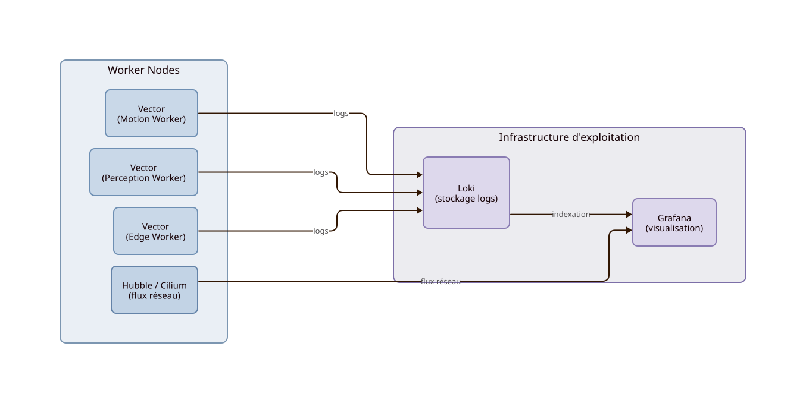

Observabilité
==============

L'observabilité ne vise pas uniquement la supervision des services. Elle couvre l'analyse du comportement distribué du système robotique : workloads, flux réseau, communications middleware, orchestration et modes dégradés.

.. important::
   Invariant — L'indisponibilité de l'observabilité ne doit jamais provoquer une panne robotique.
   L'observabilité est découplée de l'exécution opérationnelle : visibilité ≠ fonctionnement, supervision ≠ contrôle temps réel.

Introduction
-------------

L'observabilité fait partie intégrante de l'architecture. Elle n'est pas considérée comme optionnelle ni ajoutée après coup.

KubeWI ne se limite pas à la collecte de logs et aux tableaux de bord. L'architecture vise une **inspection runtime distribuée** couvrant :

- les workloads applicatifs et leur comportement ;
- les flux réseau entre pods, nœuds et services ;
- les communications middleware (ROS2, Zenoh) ;
- le comportement de l'infrastructure d'orchestration ;
- les événements réseau au niveau du dataplane.

Les agents de collecte restent déployés au plus près des workloads. Les backends d'exploitation peuvent être externalisés vers une infrastructure dédiée.

Composants locaux et backends d'exploitation
---------------------------------------------

L'observabilité distingue deux niveaux aux propriétés d'externalisation différentes :

.. list-table::
   :header-rows: 1
   :widths: 20 20 30 30

   * - Composant
     - Nature
     - Rôle
     - Externalisation
   * - **Vector**
     - agent runtime local
     - collecte et transport des logs
     - non — reste sur chaque Worker Node
   * - **Cilium / eBPF**
     - agent runtime local
     - instrumentation native du dataplane
     - non — intrinsèque au cluster
   * - **Loki**
     - backend d'exploitation
     - indexation et stockage des logs
     - oui — infrastructure d'exploitation
   * - **Grafana**
     - backend d'exploitation
     - visualisation et supervision
     - oui — infrastructure d'exploitation
   * - **Hubble UI**
     - backend d'exploitation
     - visualisation des flux réseau
     - oui — infrastructure d'exploitation

.. note::
   Vector et Cilium/eBPF sont des composants **runtime locaux** — ils ne peuvent pas être sortis du cluster.
   Loki, Grafana et Hubble UI sont des **backends d'exploitation** — ils peuvent être externalisés sans affecter le fonctionnement opérationnel.

Vector — collecte et transport
--------------------------------

Les agents Vector sont déployés sur chaque Worker Node afin de collecter les logs de la plateforme et des workloads applicatifs.

Rôle de Vector :

- collecte locale des logs sans montage partagé centralisé ;
- transport vers le backend Loki ;
- **bufferisation temporaire** en cas d'indisponibilité du backend.

.. important::
   Vector assure une résilience de transport temporaire — pas une persistance durable.
   Son rôle est de pipeline et de transit. En cas de perte prolongée du backend, les logs non envoyés peuvent être perdus selon la configuration du buffer.
   Vector n'est pas un système de persistance.

Loki — indexation des logs
---------------------------

Loki constitue le backend d'indexation et de stockage des logs.

Dans l'architecture KubeWI :

- reçoit les événements transportés par Vector ;
- stocke et indexe les logs pour consultation ultérieure ;
- sert de source de données pour Grafana ;
- peut être externalisé vers une infrastructure d'exploitation dédiée.

.. note::
   Loki est un backend d'indexation de logs — pas un système de stockage applicatif généraliste.

Grafana — visualisation
------------------------

Grafana constitue l'interface de visualisation et de supervision.

Usages principaux :

- consultation des logs via Loki ;
- supervision des workloads et de l'infrastructure ;
- corrélation entre métriques, logs et flux réseau ;
- tableaux de bord d'exploitation.

Hubble et Cilium — inspection du dataplane
-------------------------------------------

Hubble et Cilium apportent une dimension d'observabilité qualitativement différente des logs applicatifs : l'**inspection native du dataplane distribué**.

Contrairement à une sonde réseau externe, Cilium et eBPF instrumentent le réseau au niveau du noyau Linux. Cela permet d'observer :

- les connexions entre pods et services en temps réel ;
- les politiques réseau effectivement appliquées ;
- les identités des workloads communicants ;
- les flux DNS et les résolutions ;
- les métriques réseau par service et par workload ;
- les erreurs de connectivité et les rejets de politique ;
- le comportement distribué de l'infrastructure d'orchestration.

.. important::
   Hubble et Cilium ne font pas que monitorer le réseau.
   Ils réalisent une inspection native du dataplane au niveau noyau — l'observabilité réseau fait partie du runtime distribué, pas d'une couche externe optionnelle.

→ Voir :doc:`Réseau <networking>` pour le détail de l'architecture réseau.

Placement des composants d'observabilité
-----------------------------------------

Les backends d'observabilité peuvent être hébergés selon trois configurations selon les ressources disponibles et les contraintes de déploiement :

**Configuration compacte** — backends colocalisés sur le cluster robotique local lorsque les ressources disponibles le permettent. Typique des environnements edge autonomes compacts.

**Configuration standard** — backends sur une infrastructure d'exploitation dédiée locale, séparée du cluster robotique. Les agents (Vector, Cilium) restent sur les Worker Nodes.

**Configuration distribuée** — backends sur un cluster externe local ou distant. Le cluster robotique local conserve ses agents et son autonomie opérationnelle.

.. note::
   Ces trois configurations correspondent à des profils d'architecture distincts selon les contraintes edge, les ressources disponibles et le niveau d'autonomie requis.
   Dans tous les cas, les agents locaux (Vector, Cilium) restent déployés au plus près des workloads.

Observabilité et résilience
-----------------------------

.. list-table::
   :header-rows: 1
   :widths: 25 35 40

   * - Scénario
     - Comportement
     - Mécanisme architectural
   * - perte Loki
     - les workloads continuent, logs bufferisés temporairement
     - pipeline asynchrone Vector, bufferisation locale, pas de dépendance bloquante
   * - perte Grafana
     - perte de visualisation, fonctionnement local maintenu
     - visualisation séparée de l'exécution opérationnelle
   * - perte Hubble UI
     - perte de visualisation réseau, dataplane non affecté
     - Hubble UI est un frontend — Cilium/eBPF continuent d'instrumenter
   * - perte infrastructure observabilité
     - perte de supervision, fonctions robotiques maintenues
     - agents locaux autonomes, découplage exploitation/runtime
   * - perte réseau observabilité
     - workloads opérationnels maintenus
     - observabilité découplée de l'exécution, buffering local Vector

L'observabilité est découplée de l'exécution opérationnelle. Sa dégradation impacte la visibilité mais pas le fonctionnement du système robotique.

→ Voir :doc:`Modes dégradés <resilience>` pour les scénarios complets.

Positionnement architectural
------------------------------

L'observabilité KubeWI repose sur trois principes :

**Collecte distribuée** — les agents sont déployés au plus près des workloads, pas dans un composant central.

**Backend externalisable** — Loki, Grafana et Hubble UI peuvent être sortis du cluster robotique local sans affecter le fonctionnement opérationnel.

**Non-bloquante** — l'indisponibilité de l'observabilité ne doit jamais provoquer une panne robotique.

