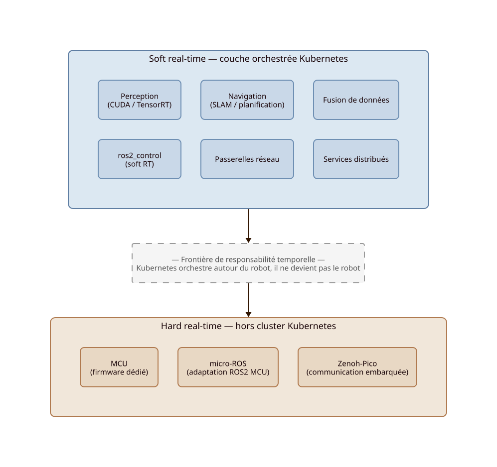

Temps réel
===========

Kubernetes orchestre autour du robot — il ne devient pas le robot.

Introduction
-------------

Le système robotique est considéré comme **temporellement hétérogène** : certaines fonctions nécessitent des garanties déterministes strictes, tandis que d'autres peuvent tolérer variabilité, orchestration distribuée et redéploiement.

KubeWI organise explicitement cette hétérogénéité. La séparation hard real-time / soft real-time constitue un **invariant architectural fondamental** du projet.

L'objectif n'est pas d'utiliser Kubernetes pour exécuter toutes les fonctions robotiques, mais de placer chaque fonction dans la couche correspondant à ses contraintes temporelles réelles.

Principe général
-----------------

- Les fonctions hard real-time doivent rester au plus près du matériel.
- Les fonctions tolérant jitter et variabilité peuvent être orchestrées.
- Toutes les fonctions robotiques ne possèdent pas les mêmes contraintes temporelles.
- L'orchestration distribuée ne doit pas perturber les fonctions critiques.
- La frontière entre ces domaines doit être explicite, documentée et respectée.

Répartition des responsabilités
---------------------------------

.. list-table::
   :header-rows: 1
   :widths: 35 20 45

   * - Fonction
     - Contrainte
     - Placement recommandé
   * - Contrôle moteur / PWM
     - Hard RT
     - MCU / firmware
   * - Acquisition capteurs critiques
     - Hard RT
     - MCU / local
   * - Contrôle déterministe actionneurs
     - Hard RT
     - firmware / micro-ROS
   * - Communication embarquée légère
     - Hard RT
     - Zenoh-Pico
   * - Perception (vision, IA)
     - Soft RT
     - cluster robotique local
   * - Fusion de données
     - Soft RT
     - cluster robotique local
   * - Navigation / SLAM
     - Soft RT
     - cluster robotique local
   * - Passerelles réseau
     - Soft RT
     - cluster robotique local
   * - Services distribués
     - Soft RT
     - cluster robotique local
   * - Observabilité / stockage froid
     - Non critique
     - infrastructure d'exploitation

.. note::
   L'observabilité backend et le stockage froid appartiennent à l'infrastructure d'exploitation. Ils ne constituent pas des composants temps réel du cluster robotique opérationnel.

Hard real-time
---------------

Les composants hard real-time restent hors de la couche orchestrée Kubernetes.

**Fonctions concernées :**

- contrôle moteur et PWM ;
- pilotage direct d'actionneurs ;
- acquisition déterministe de capteurs critiques ;
- bus terrain critiques ;
- sécurité immédiate et arrêt d'urgence.

**Ces fonctions s'exécutent :**

- sur MCU ;
- via firmware dédié ;
- via micro-ROS ;
- via Zenoh-Pico ;
- ou directement au niveau matériel.

.. important::
   Le projet ne considère pas Kubernetes comme une couche adaptée aux garanties hard real-time strictes.
   Certains mécanismes — PREEMPT_RT, pinning CPU, isolation de cœurs, tuning noyau — peuvent améliorer
   la stabilité temporelle locale, mais ne constituent pas des garanties déterministes équivalentes à un firmware embarqué.

Soft real-time
---------------

Certaines fonctions robotiques tolèrent une variabilité temporelle compatible avec une architecture distribuée orchestrée. Ce ne sont pas des fonctions "non temps réel" — elles ont des contraintes, mais celles-ci restent compatibles avec un scheduler généraliste et un réseau IP.

**Exemples de fonctions soft RT orchestrables :**

- perception (CUDA / TensorRT) ;
- IA embarquée et inférence ;
- SLAM et localisation ;
- navigation et planification ;
- fusion de données distribuée ;
- passerelles réseau et services distribués.

Ces workloads bénéficient dans Kubernetes de :

- reproductibilité des déploiements ;
- redéploiement automatique en cas de défaillance ;
- placement explicite selon les capacités matérielles ;
- orchestration et supervision distribuées.

.. note::
   Kubernetes n'est pas une couche soft real-time au sens strict. Ce sont les fonctions qui sont soft RT —
   et certaines d'entre elles peuvent être orchestrées dans Kubernetes sans violer leurs contraintes temporelles.

Frontière de responsabilité temporelle
-----------------------------------------

La plateforme ne cherche pas à supprimer la frontière entre hard real-time et orchestration distribuée. Elle cherche au contraire à **la rendre explicite et à en faire une frontière de responsabilité**.

.. list-table::
   :header-rows: 1
   :widths: 30 35 35

   * - Zone
     - Responsable du timing
     - Mécanisme
   * - Hard RT
     - firmware / matériel
     - MCU, RTOS, boucles déterministes
   * - Soft RT
     - système distribué
     - scheduler Linux, réseau IP, middleware
   * - Orchestration
     - cluster Kubernetes
     - scheduler k0s, kubelet, CNI

Cette frontière permet de :

- préserver les contraintes critiques indépendamment de l'état du cluster ;
- maintenir des comportements prévisibles dans les couches basses ;
- limiter les dépendances entre couches de temporalité différente ;
- faciliter les modes dégradés en cas de perte partielle d'infrastructure.

Résilience hard RT
-------------------

Les fonctions critiques ne doivent pas dépendre de la disponibilité immédiate du cluster.

.. list-table::
   :header-rows: 1
   :widths: 40 60

   * - Scénario
     - Comportement
   * - perte du cluster Kubernetes
     - les composants hard RT restent opérationnels
   * - perte de l'observabilité
     - firmware et contrôle local maintenus sans dépendance aux backends
   * - perte de la communication distribuée
     - les boucles critiques locales sont maintenues
   * - perte de l'infrastructure d'exploitation
     - aucune dépendance immédiate des MCU et firmware

Le découplage orchestration / contrôle est volontaire et structurel : une panne d'orchestration ne doit pas interrompre le contrôle bas niveau.

→ Voir :doc:`Modes dégradés <resilience>` pour les scénarios complets.

Positionnement architectural
------------------------------

La séparation hard RT / soft RT garantit que :

- les boucles critiques ne dépendent pas de Kubernetes ;
- les pannes d'orchestration n'interrompent pas le contrôle bas niveau ;
- l'observabilité et le stockage froid peuvent être externalisés sans impact opérationnel ;
- les modes dégradés préservent les fonctions essentielles.

Kubernetes orchestre les composants distribués, observables et redéployables **autour** du système robotique. Les contraintes hard real-time restent portées par le matériel et le firmware, au plus près du monde physique.
