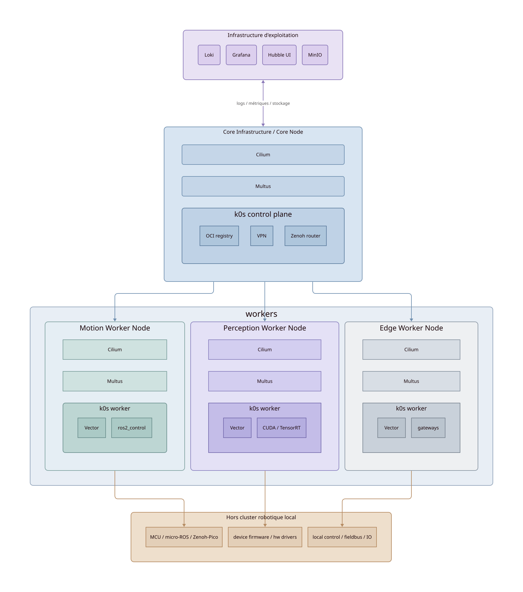

KubeWI
======

**Plateforme d'infrastructure robotique distribuée**

KubeWI formalise une infrastructure cohérente pour des systèmes robotiques distribués
mêlant plusieurs machines, plusieurs niveaux de criticité et plusieurs types de calcul.

Le projet ne cherche pas uniquement à déployer des conteneurs ou à exécuter ROS2 sur Kubernetes.
Il vise à rendre explicites des problématiques souvent implicites dans la robotique moderne :
placement des charges applicatives, séparation des contraintes temps réel, communication distribuée,
observabilité, gestion réseau, reproductibilité des environnements, exploitation multi-nœuds hétérogènes.

----

Ce qu'est la plateforme
-----------------------

KubeWI est :

- une plateforme d'orchestration robotique distribuée ;
- un socle d'infrastructure basé sur Linux et Kubernetes ;
- un environnement de déploiement reproductible ;
- une architecture explicitant les contraintes réseau, stockage et communication ;
- une séparation assumée entre hard real-time et soft real-time ;
- une couche d'exploitation pour systèmes ROS2 distribués.

.. list-table::
   :header-rows: 1
   :widths: 20 80

   * - Composant
     - Rôle
   * - k0s
     - orchestration Kubernetes légère
   * - Cilium
     - dataplane réseau basé eBPF
   * - Multus
     - interfaces réseau multiples
   * - Zenoh
     - communication distribuée
   * - Vector + Loki + Grafana
     - observabilité
   * - Hubble
     - visibilité réseau
   * - MinIO
     - stockage objet
   * - Ansible
     - provisioning déclaratif

----

Ce que la plateforme n'est pas
-------------------------------

KubeWI n'est pas :

- un framework robotique remplaçant ROS2 ;
- une distribution Linux temps réel ;
- un système de contrôle moteur hard real-time ;
- une abstraction masquant totalement Kubernetes ;
- une plateforme cloud générique.

Le projet considère que certaines contraintes doivent rester proches du matériel :
boucles moteurs, contrôle critique, acquisition déterministe, microcontrôleurs.
Ces composants restent hors orchestration Kubernetes.

----

Architecture cible
------------------

----

Cas d'usage visés
-----------------

**Robotique distribuée** : robots multi-calculateur, perception déportée, coordination multi-agents.

**Plateformes ROS2 hétérogènes** : Jetson, Raspberry Pi, serveurs x86, workloads CPU/GPU mixtes.

**Edge robotics** : systèmes embarqués connectés ou isolés, fonctionnement déconnecté d'un cloud externe.

**Laboratoires et R&D** : expérimentation reproductible, validation d'architectures distribuées.

----

.. toctree::
   :hidden:

   architecture/overview
   provisioning/bare-metal
   reference/packages
   reference/glossary
