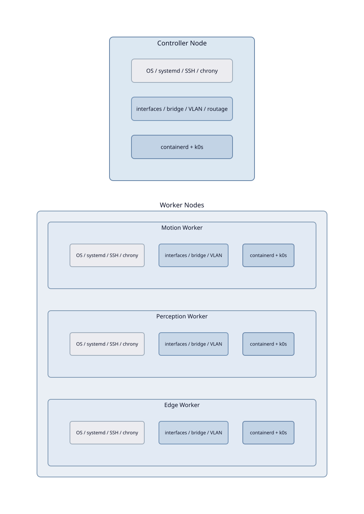

Provisioning bare-metal
========================

Cette section décrit le provisioning des nœuds physiques permettant d'obtenir un cluster Kubernetes opérationnel.

----

Architecture cible
-------------------

----

Périmètre du provisioning
--------------------------

Le provisioning repose sur une installation OS non-interactive (Ventoy +
cloud-init autoinstall) suivie d'une configuration déclarative des nœuds
via Ansible. Une fois le système installé, Ansible **désactive cloud-init**
(``/etc/cloud/cloud-init.disabled``) pour éviter toute reconfiguration
lors des redémarrages ultérieurs.

- l'installation OS non-interactive (Ventoy, cloud-init autoinstall, Ubuntu 24.04) ;
- le provisioning système (OS, systemd, SSH, chrony, cgroups RPi) ;
- le réseau Linux (bridge ``br0``, VLANs 220/420/620, routage, DNS) ;
- le runtime conteneur (containerd) ;
- le bootstrap et l'enrôlement Kubernetes (k0s).

Chaque machine est préparée afin de fournir un nœud Kubernetes opérationnel et persistant après redémarrage.

----

Résultat attendu
-----------------

- le controller expose une API Kubernetes fonctionnelle ;
- les workers rejoignent correctement le cluster ;
- les communications réseau inter-nœuds sont opérationnelles ;
- l'infrastructure survit aux redémarrages système.

----

.. toctree::
   :hidden:

   install-os
   prerequisites
   ansible
   system
   network
   wireguard
   controller
   worker
   validation
