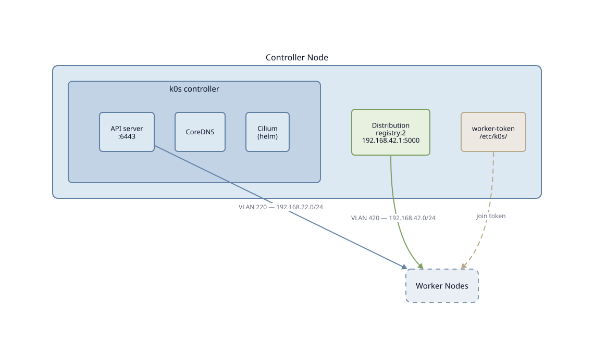

Controller node
================

Le controller héberge le plan de contrôle Kubernetes (k0s) et constitue
le point central du cluster. Il expose l'API server sur le VLAN 220
et génère le token de jonction pour les workers.

.. contents:: Sections
   :local:
   :depth: 1

----

Hardware
--------

.. TODO: spécifications matérielles minimales et recommandées du controller node

----

Installation k0s
----------------

| Rôle : `roles/k0s_controller/tasks/install.yml <https://github.com/iobewi/kubewi/blob/main/ansible/roles/k0s_controller/tasks/install.yml>`_

Le binaire k0s est téléchargé depuis les releases GitHub du projet.
La version est résolue dynamiquement depuis la dernière release stable
au moment de l'exécution. L'architecture est détectée automatiquement
(``amd64`` ou ``arm64``).

----

Configuration
-------------

| Rôle : `roles/k0s_controller/tasks/configure.yml <https://github.com/iobewi/kubewi/blob/main/ansible/roles/k0s_controller/tasks/configure.yml>`_
| Template : `roles/k0s_controller/templates/k0s.yaml.j2 <https://github.com/iobewi/kubewi/blob/main/ansible/roles/k0s_controller/templates/k0s.yaml.j2>`_

La configuration k0s est déployée dans ``/etc/k0s/k0s.yaml``.

.. list-table::
   :header-rows: 1
   :widths: 35 65

   * - Paramètre
     - Valeur
   * - ``api.address``
     - ``192.168.22.1`` (VLAN 220)
   * - ``api.port``
     - ``6443``
   * - ``network.provider``
     - ``custom`` (Cilium gère le dataplane)
   * - ``network.podCIDR``
     - ``10.244.0.0/16``
   * - ``network.serviceCIDR``
     - ``10.96.0.0/12``

Cilium est déployé automatiquement via les extensions helm de k0s au
démarrage du controller. La variable ``k0s_cilium_version`` dans
``roles/k0s_controller/defaults/main.yml`` contrôle la version déployée.

----

Démarrage du service
--------------------

| Rôle : `roles/k0s_controller/tasks/service.yml <https://github.com/iobewi/kubewi/blob/main/ansible/roles/k0s_controller/tasks/service.yml>`_

k0s est installé comme service systemd (``k0scontroller``), activé au
boot. Le rôle attend que l'API soit disponible sur le port 6443 avant
de continuer.

----

Token de jonction
-----------------

| Rôle : `roles/k0s_controller/tasks/token.yml <https://github.com/iobewi/kubewi/blob/main/ansible/roles/k0s_controller/tasks/token.yml>`_

Un token de jonction worker est généré après démarrage du controller
et sauvegardé dans ``/etc/k0s/worker-token``. Ce token sera utilisé
lors de l'enrollment des workers.

----

Exécution
---------

Simuler avant d'appliquer :

.. code-block:: bash

   ansible-playbook -i inventory/hosts.yml playbooks/controller.yml --check --diff

Puis appliquer :

.. code-block:: bash

   ansible-playbook -i inventory/hosts.yml playbooks/controller.yml

Vérifier que le controller est opérationnel :

.. code-block:: bash

   k0s kubectl get nodes
   k0s kubectl get pods -n kube-system
