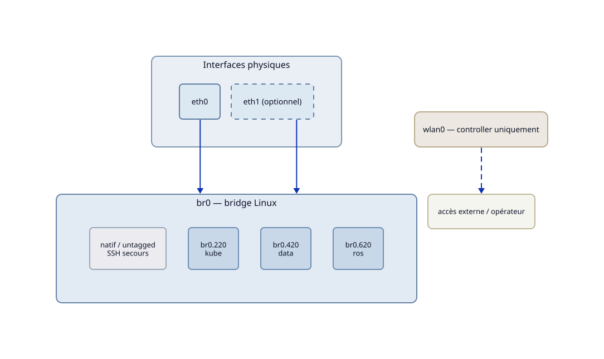

Configuration réseau
=====================

Cette configuration s'applique à tous les nœuds du cluster,
indépendamment de leur rôle Kubernetes.
La stack réseau repose intégralement sur ``systemd-networkd``.

.. contents:: Sections
   :local:
   :depth: 1

----

Bridge
------

| Rôle : `roles/network/tasks/bridge.yml <https://github.com/iobewi/kubewi/blob/main/ansible/roles/network/tasks/bridge.yml>`_
| Templates : `bridge.netdev.j2 <https://github.com/iobewi/kubewi/blob/main/ansible/roles/network/templates/bridge.netdev.j2>`_,
  `bridge-member.network.j2 <https://github.com/iobewi/kubewi/blob/main/ansible/roles/network/templates/bridge-member.network.j2>`_,
  `bridge.network.j2 <https://github.com/iobewi/kubewi/blob/main/ansible/roles/network/templates/bridge.network.j2>`_

Un bridge Linux ``br0`` est créé sur chaque nœud. Les interfaces
physiques déclarées dans ``host_vars`` sont attachées comme membres
du bridge sans adresse IP propre.

Le bridge porte le trafic natif (non taggé) et les sous-interfaces
VLAN. Le trafic natif reste disponible pour un accès SSH de secours
en cas de défaillance de la configuration VLAN.

Le nombre de membres s'adapte au matériel du nœud :

- ``network_bridge_members: [eth0]`` — nœud à une interface
- ``network_bridge_members: [eth0, eth1]`` — nœud à deux interfaces

----

VLANs
-----

| Rôle : `roles/network/tasks/vlans.yml <https://github.com/iobewi/kubewi/blob/main/ansible/roles/network/tasks/vlans.yml>`_
| Templates : `vlan.netdev.j2 <https://github.com/iobewi/kubewi/blob/main/ansible/roles/network/templates/vlan.netdev.j2>`_,
  `vlan.network.j2 <https://github.com/iobewi/kubewi/blob/main/ansible/roles/network/templates/vlan.network.j2>`_

Trois VLANs sont déployés sur le bridge, communs à tous les nœuds :

.. list-table::
   :header-rows: 1
   :widths: 12 22 26 40

   * - VLAN
     - Interface
     - Sous-réseau
     - Domaine
   * - 220
     - ``br0.220``
     - ``192.168.22.0/24``
     - Infrastructure Kubernetes (k0s API, pod network, CoreDNS)
   * - 420
     - ``br0.420``
     - ``192.168.42.0/24``
     - Transferts (Vector, Loki, OCI registry, MinIO)
   * - 620
     - ``br0.620``
     - ``192.168.62.0/24``
     - Communications robotiques (ROS2, Zenoh)

Les VLANs sont déclarés dans ``inventory/group_vars/all.yml`` via
``network_vlans``. Les adresses IP par nœud sont configurables via
``network_vlan_ips`` dans le ``host_vars`` du nœud.

----

WiFi
----

| Rôle : `roles/network/tasks/wifi.yml <https://github.com/iobewi/kubewi/blob/main/ansible/roles/network/tasks/wifi.yml>`_
| Templates : `wifi.network.j2 <https://github.com/iobewi/kubewi/blob/main/ansible/roles/network/templates/wifi.network.j2>`_,
  `wpa_supplicant.conf.j2 <https://github.com/iobewi/kubewi/blob/main/ansible/roles/network/templates/wpa_supplicant.conf.j2>`_

L'interface WiFi ``wlan0`` est configurée uniquement sur le controller.
Elle constitue l'interface de communication externe normale du robot
(accès opérateur, réseau terrain).

La tâche WiFi ne s'exécute que si ``network_wifi`` est défini dans
le ``host_vars`` du nœud. Les workers ne sont pas affectés.

Les credentials WiFi (SSID, PSK) ne doivent pas être versionnés en
clair. Ils sont déclarés dans ``inventory/group_vars/vault.yml`` et
référencés via les variables ``vault_wifi_ssid`` et ``vault_wifi_psk``.

Chiffrer le vault avant le premier run :

.. code-block:: bash

   ansible-vault encrypt inventory/group_vars/vault.yml

Exécuter le playbook avec le vault :

.. code-block:: bash

   ansible-playbook -i inventory/hosts.yml playbooks/network.yml --ask-vault-pass

----

Exécution
---------

Simuler avant d'appliquer :

.. code-block:: bash

   ansible-playbook -i inventory/hosts.yml playbooks/network.yml --check --diff

Puis appliquer :

.. code-block:: bash

   ansible-playbook -i inventory/hosts.yml playbooks/network.yml
