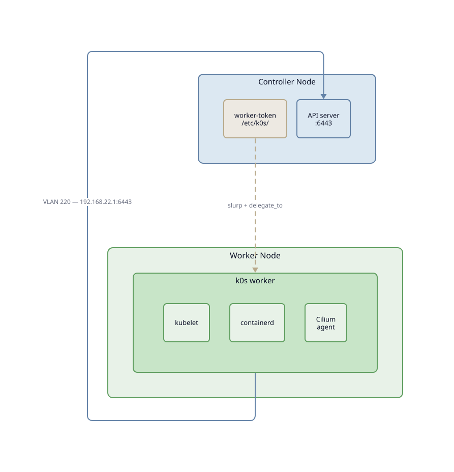

Worker node
============

Les workers hébergent les charges de travail Kubernetes. Chaque worker
rejoint le cluster via un token généré par le controller et communique
avec l'API server sur le VLAN 220.

.. contents:: Sections
   :local:
   :depth: 1

----

Hardware
--------

.. TODO: spécifications matérielles selon profil (Motion / Perception / Edge)

----

Installation k0s
----------------

| Rôle : `roles/k0s_worker/tasks/install.yml <https://github.com/iobewi/kubewi/blob/main/ansible/roles/k0s_worker/tasks/install.yml>`_

Le binaire k0s est téléchargé depuis les releases GitHub du projet.
La version est résolue dynamiquement depuis la dernière release stable
au moment de l'exécution. L'architecture est détectée automatiquement
(``amd64`` ou ``arm64``).

----

Token de jonction
-----------------

| Rôle : `roles/k0s_worker/tasks/token.yml <https://github.com/iobewi/kubewi/blob/main/ansible/roles/k0s_worker/tasks/token.yml>`_

Le token de jonction est généré par le controller et sauvegardé dans
``/etc/k0s/worker-token``. Le rôle worker le récupère directement depuis
le controller via ``delegate_to`` (sans intervention manuelle) et l'écrit
localement sur chaque worker.

.. code-block:: yaml

   delegate_to: "{{ groups['controllers'][0] }}"

Le token est chiffré côté k0s et expire selon la politique du cluster.

----

Démarrage du service
--------------------

| Rôle : `roles/k0s_worker/tasks/service.yml <https://github.com/iobewi/kubewi/blob/main/ansible/roles/k0s_worker/tasks/service.yml>`_

k0s est installé comme service systemd (``k0sworker``), activé au boot.
Le rôle attend que le nœud apparaisse à l'état ``Ready`` dans le cluster
avant de passer au nœud suivant.

.. code-block:: bash

   k0s install worker --token-file /etc/k0s/worker-token

Le service démarre kubelet, containerd, et l'agent Cilium. Le nœud
rejoint le plan de contrôle via l'API server sur ``192.168.22.1:6443``
(VLAN 220).

----

Exécution
---------

Simuler avant d'appliquer :

.. code-block:: bash

   ansible-playbook -i inventory/hosts.yml playbooks/worker.yml --check --diff

Puis appliquer :

.. code-block:: bash

   ansible-playbook -i inventory/hosts.yml playbooks/worker.yml

Vérifier que les workers ont rejoint le cluster :

.. code-block:: bash

   k0s kubectl get nodes
