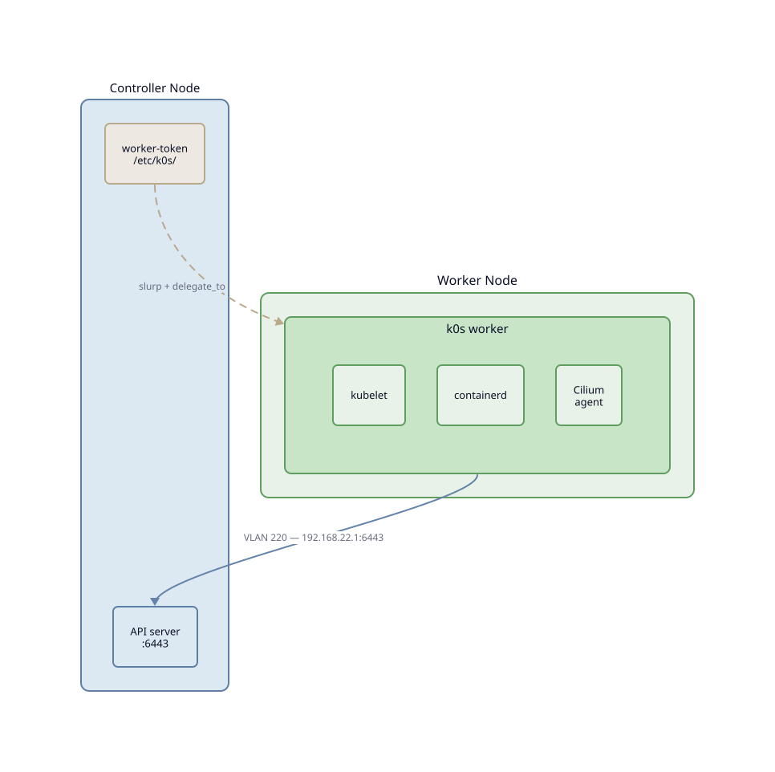

Implémentation
==============

L'enrollment est divisé en deux phases distinctes pour permettre
le redémarrage en cas d'échec :

- **Phase 1** (``worker_init``) — bootstrap réseau : configure les
  interfaces réseau du worker, assigne les VLANs, configure SSH par
  mot de passe (requis pour les nœuds vierges).
- **Phase 2** (``add_worker``) — provisioning k0s : joint le nœud au
  cluster Kubernetes via le token généré par le controller.

Si la phase 1 échoue, le DHCP de provisioning reste actif pour
permettre le debug. Un message invite à ``kubewi provisioning off``
pour le désactiver manuellement.

``--single`` combine ``--yes`` et active le mode automatique : utile
pour ``kubewi cluster apply`` qui enchaine plusieurs nœuds sans
interaction.

Réseau de provisioning
----------------------

Un worker fraîchement installé n'a pas d'IP sur le réseau cluster.
Le controller expose un réseau de provisioning sur ``br0`` natif
(``192.168.0.0/24``) via le pod ``dnsmasq-provisioning``.

Ce pod est **arrêté par défaut** (``replicas: 0``). Il s'active uniquement
pendant l'enrollment. Une fois branché sur le switch cluster, le worker
obtient une IP temporaire (``192.168.0.x``) qui permet le provisioning
Ansible via ProxyJump à travers le controller.

Après la Phase 1, ``eth0`` devient membre du bridge — l'IP de provisioning
disparaît. Le worker n'est ensuite accessible que via ses IPs VLAN.

Séquence de détection (``lib/detection.py``)
---------------------------------------------

1. Scale ``dnsmasq-provisioning`` à 1
2. Lecture des baux dnsmasq en continu
3. Pour chaque bail détecté : calcule ``host_id`` (dernier octet VLAN 220),
   ajoute le nœud dans ``inventory/hosts.yml`` avec ``init_host`` = IP provisioning
4. ``[Entrée]`` pour terminer la détection en mode multi-nœud
5. Confirmation, puis phases Ansible
6. Scale à 0 en cas de succès
