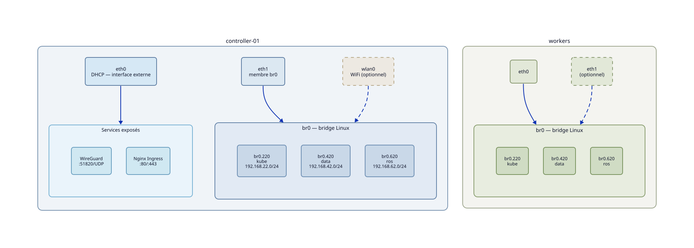

Rôle
====

``plg_gateway`` configure la couche réseau Linux de l'ensemble du cluster
et le point d'accès WiFi optionnel.

----

Architecture réseau
--------------------

Chaque nœud porte un bridge Linux ``br0`` auquel les interfaces physiques
sont attachées. Trois VLANs 802.1Q communs à tous les nœuds :

.. list-table::
   :header-rows: 1
   :widths: 10 18 22 50

   * - VLAN
     - Interface
     - Sous-réseau
     - Domaine
   * - 220
     - ``br0.220``
     - ``192.168.22.0/24``
     - Infrastructure Kubernetes (API k0s, pod network, CoreDNS)
   * - 420
     - ``br0.420``
     - ``192.168.42.0/24``
     - Transferts (OCI registry, Vector, Loki, MinIO)
   * - 620
     - ``br0.620``
     - ``192.168.62.0/24``
     - Communications robotiques (ROS 2, Zenoh)

L'adresse IP de chaque nœud est calculée depuis ``host_id`` :

.. code-block:: yaml

   network_vlan_ips:
     "220": "192.168.22.{{ host_id }}/24"
     "420": "192.168.42.{{ host_id }}/24"
     "620": "192.168.62.{{ host_id }}/24"

----

Trois rôles, trois groupes
---------------------------

.. list-table::
   :header-rows: 1
   :widths: 18 18 64

   * - Rôle
     - Groupe
     - Périmètre
   * - ``network``
     - ``all``
     - Arrêt dhcpcd/NetworkManager, bridge ``br0``, VLANs
   * - ``gateway``
     - ``gateways``
     - Interface externe DHCP, NAT (``kubewi-nat.service``),
       DNS cluster (``systemd-resolved`` sur ``192.168.22.1``)
   * - ``internal``
     - ``all:!gateways``
     - Route par défaut ``192.168.22.1``, ``resolv.conf`` → ``192.168.22.1``

Le rôle ``internal`` nécessite que le rôle ``gateway`` soit déjà appliqué :
les workers pointent vers ``192.168.22.1`` comme gateway et DNS.

----

``plg_gateway`` configure le nœud physique qui sert de frontière entre le
LAN externe et les VLANs internes du cluster. Il met en place le NAT vers
l'extérieur, l'interface réseau externe en DHCP, les adresses IP des VLANs
sur le nœud gateway, et optionnellement un point d'accès WiFi bridgé sur le
VLAN 220 (``wifi_ap`` défini dans l'inventaire).

Un gateway est un controller k0s avec des responsabilités réseau
supplémentaires — ``plg_gateway`` ne gère que la couche réseau physique,
pas k0s lui-même.

----

Couches
-------

- ``playbooks/gateway.yml`` — applique les rôles ``network``, ``gateway``
  et ``wireguard`` sur le groupe ``gateways``
- ``playbooks/wifi.yml`` — applique le rôle ``hostapd`` (conditionné à
  ``wifi_ap`` défini dans l'inventaire)

**Rôle** ``gateway``
   - Déploie les fichiers ``systemd-networkd`` pour les VLANs du gateway
     (adresse IP seule, sans route par défaut)
   - Déploie l'interface externe (``network_external_iface``) en DHCP
   - Installe et active le service ``kubewi-nat`` (iptables MASQUERADE)
   - Configure ``systemd-resolved`` pour écouter sur le VLAN 220

**Rôle** ``hostapd``
   - Installe ``hostapd``
   - Crée le bridge ``br-wifi`` et y attache ``br0.220`` comme slave
   - Configure ``wlan0`` comme interface hostapd avec ``bridge=br-wifi``
   - Déploie ``/etc/hostapd/hostapd.conf``
   - Active et démarre le service

----

Bridge WiFi — architecture L2
-------------------------------

Le bridge WiFi a été introduit pour supporter **embewi** — des agents
ESP32 orchestrés par Kubernetes via les CRDs ``McuNode`` et
``McuDeployment`` (`embewi-core <https://github.com/iobewi/embewi-core>`_).

L'ESP32 se provisionne via un portail captif WiFi (AP ``embewi-XXXX``),
obtient une IP ``192.168.22.x`` sur VLAN 220, et rejoint le cluster comme
n'importe quel nœud — Kubernetes crée un ``Service`` + ``EndpointSlice``
par device, les firmwares sont déployés via OTA depuis le registry OCI
interne (VLAN 420).

Sans WiFi AP, ``br0.220`` porte directement l'IP du VLAN 220 :

.. code-block:: text

   br0 ──── br0.220  (IP 192.168.22.1/24)
              ↑
           VLAN 220 (802.1Q tag)

Avec ``wifi_ap`` défini, ``br0.220`` devient slave de ``br-wifi``.
C'est ``br-wifi`` qui porte l'IP. ``wlan0`` est ajouté automatiquement
au bridge par hostapd lors de l'association d'un client :

.. code-block:: text

   br0 ──── br0.220 ──► slave de br-wifi (IP 192.168.22.1/24)
                                │
                           br-wifi ◄── wlan0 (hostapd, access port)
                                │
                         clients WiFi
                      (VLAN 220, L2 pur)

Les clients WiFi arrivent directement sur le VLAN 220 — même segment L2
que les nœuds filaires. Il n'y a pas de NAT, pas de routage supplémentaire,
pas de sous-réseau dédié WiFi. Un client WiFi et un worker Ethernet
partagent le même ``192.168.22.0/24``.

.. list-table::
   :header-rows: 1
   :widths: 30 70

   * - Interface
     - Rôle avec WiFi AP
   * - ``br0.220``
     - Slave du bridge ``br-wifi`` (plus d'IP directe)
   * - ``br-wifi``
     - Porte l'IP ``192.168.22.1/24`` — bridge L2 VLAN 220 ↔ WiFi
   * - ``wlan0``
     - Access port géré par hostapd (``bridge=br-wifi`` dans hostapd.conf)

Ce choix (bridge L2 plutôt que routage ou NAT WiFi) est indispensable pour
embewi : ``embewi-core`` atteint l'ESP32 directement via son
``EndpointSlice`` (IP ``192.168.22.x``), et l'ESP32 envoie son heartbeat
vers ``192.168.22.1:8080`` sans routage supplémentaire. ROS 2 et les
outils kubewi bénéficient du même accès transparent depuis le WiFi.

----

Dépendances
-----------

.. list-table::
   :header-rows: 1
   :widths: 30 70

   * - Paquet
     - Ce qui est utilisé
   * - ``adp_ansible``
     - exécution des playbooks via ``ansible.run_playbook()``
   * - ``plg_vpn``
     - le tunnel WireGuard doit être déployé pour que le gateway soit joignable
   * - ``ops_cluster``
     - le rôle ``network`` (bridge br0, VLANs) doit avoir été appliqué avant
